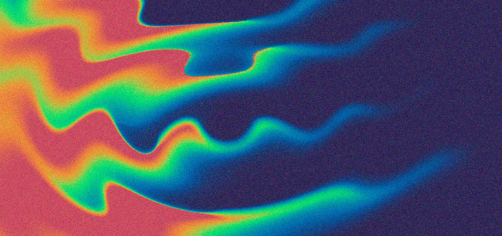
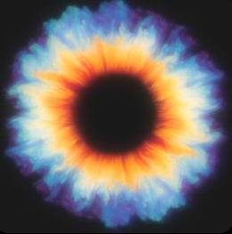

<table>
<tr>
<td align="center">

</td>
</tr>
</table>

#  Welcome to Astraya's Universe

<table width="100%">
<tr>

<td width="72%" valign="top">

## About Me

Hi, I'm **Aya**.

I'm a Network & Computer Science student from Morocco.

I enjoy designing networks, exploring cybersecurity, learning Linux, and automating tasks with Python.

Currently building real-world CCNA labs and documenting everything on GitHub.

</td>

<td align="center" width="28%">

</td>

</tr>
</table>
